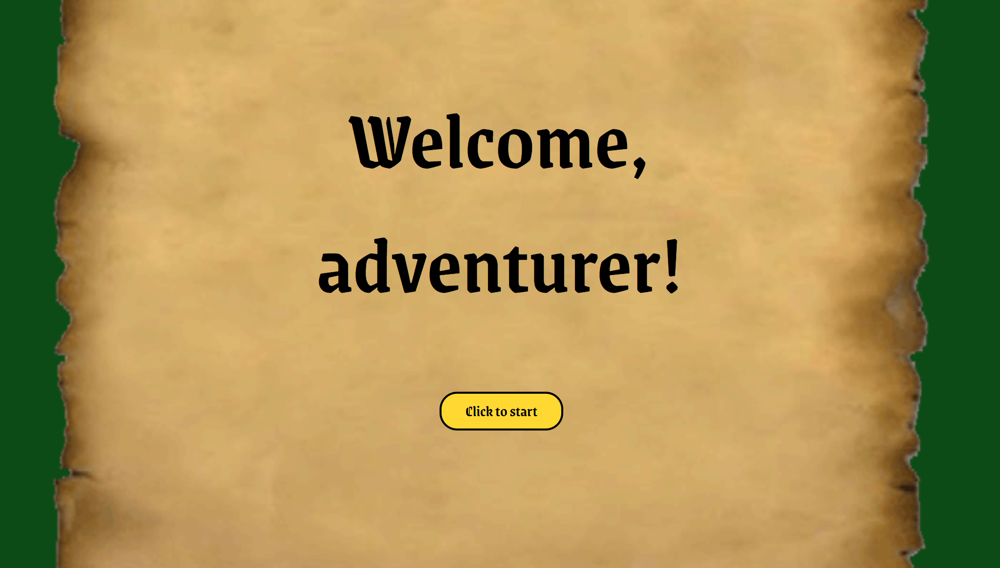

# Welcome, Adventurer!

## Table of Contents

* [Description](#description)
* [Link](#links)
* [Screenshots](#screenshots)
* [Installation](#installation)
* [Usage](#usage)
* [Technologies Used](#technologies)
* [Tests](#tests)
* [Credits](#credits)
* [Contributing](#contributing)
* [Questions](#questions)
* [Badges](#badges)

## Description

This is a simple text adventure game using JavaScript alerts and prompts. Just enter your name and a cardinal direction (all lowercase, please!) and you're off on an adventure! A roll of the dice will determine the difference between life and death, between destitution and prosperity, between the life of a thief and that of a watchman. Come try your luck! And may the dice favor you....

NOTE: Currently, South is completely built out. East is nearing completion. North has been started. Please don't go West, you won't get anywhere.

## Link

[Welcome, Adventurer!](https://lauracole1900.github.io/textAdventure/)

## Screenshots

Landing page:

## Installation

N/A

## Usage

This is intended as casual gaming. Feel free to use it to waste a few minutes.

## Technologies Used

HTML5, CSS3, JavaScript

## Tests

N/A

## Credits

Many thanks to my fellow students from DU's Coding Bootcamp, Fall 2020 Full-Time cohort, for offering their ideas when mine ran dry

## Contributing

We believe code is never finished, and welcome your contributions to enhance the application's functionality. Please adhere to the Code of Conduct for the Contributor Covenant, version 2.0, at https://www.contributor-covenant.org/version/2/0/code_of_conduct.html.

## Questions

If you have further questions, you can reach me at lauracole1900@comcast.net. For more of my work, see [my GitHub](https://github.com/LauraCole1900).

## Badges

 